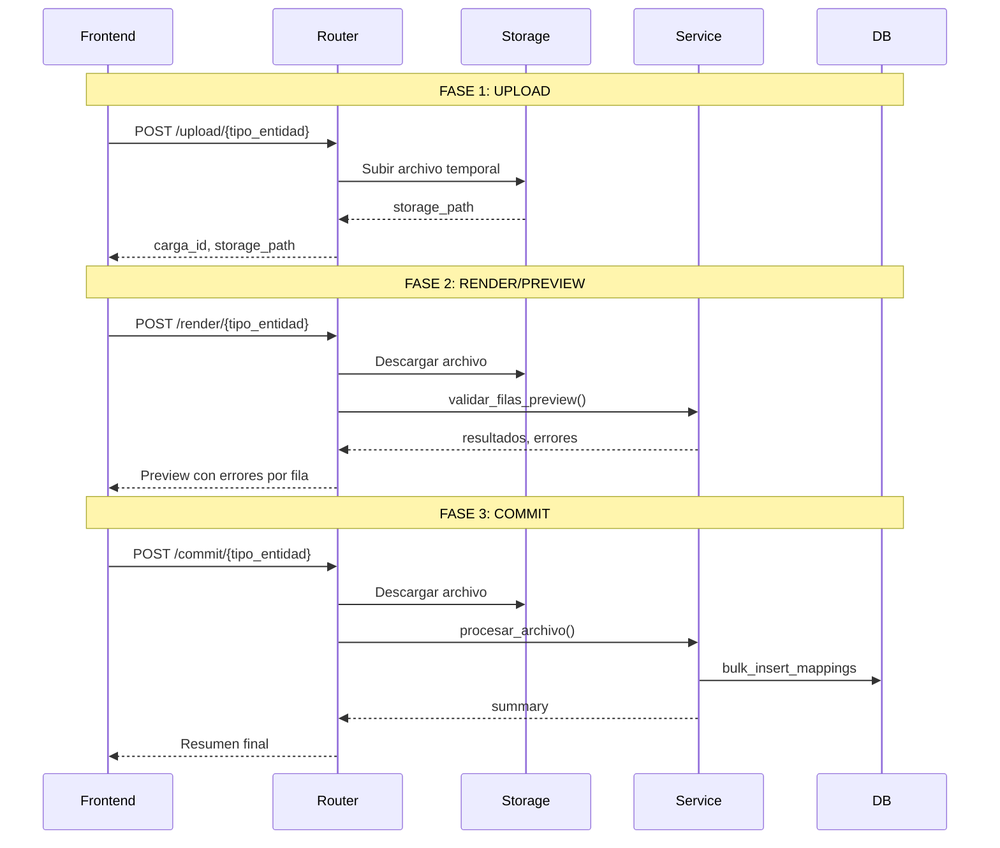

# Sistema de Carga Masiva Genérica

Sistema genérico de carga masiva de datos desde archivos Excel/CSV para aplicaciones FastAPI + SQLAlchemy.

## 🎯 Características

- **📤 Upload**: Sube archivos CSV, XLS o XLSX al storage
- **👁️ Preview**: Valida y previsualiza errores antes de guardar
- **💾 Commit**: Persiste solo datos válidos en la base de datos
- **🔄 Genérico**: Fácil de extender para nuevas entidades
- **🚀 Batch**: Inserción eficiente con `bulk_insert_mappings`
- **🎨 Validaciones**: Sistema robusto de validaciones por fila
- **📦 Storage**: Soporta local, Firebase Storage y AWS S3

## 🏗️ Arquitectura

El sistema implementa un patrón de **carga masiva en 3 fases**:

```
UPLOAD → RENDER (Preview) → COMMIT (Persistir)
```

### Flujo de Operación



## 📋 Requisitos Previos

- Python 3.9+
- PostgreSQL / MySQL / SQLite
- pip

## 🚀 Instalación

### 1. Clonar el Repositorio

```bash
git clone <repository-url>
cd carga_masiva_generico
```

### 2. Crear Entorno Virtual

```bash
python -m venv venv
source venv/bin/activate  # En Windows: venv\Scripts\activate
```

### 3. Instalar Dependencias

```bash
pip install -r requirements.txt
```

### 4. Configurar Variables de Entorno

Copiar el archivo de ejemplo y configurar:

```bash
cp .env.example .env
```

Editar `.env` con tus configuraciones:

```env
DATABASE_URL=sqlite:///./carga_masiva.db
STORAGE_TYPE=local
UPLOAD_DIR=./uploads
```

### 5. Inicializar Base de Datos

```bash
python init_db.py
```

Este script crea las tablas y datos de ejemplo (categorías, productos, proveedores).

### 6. Generar Plantillas de Ejemplo

```bash
python generar_plantillas.py
```

Genera archivos Excel de ejemplo en el directorio `plantillas/`:
- `plantilla_productos.xlsx` - Datos válidos
- `plantilla_productos_con_errores.xlsx` - Para testing

## 🎮 Ejecutar la Aplicación

```bash
uvicorn main:app --reload
```

La aplicación estará disponible en:
- **API**: http://localhost:8000
- **Documentación Interactiva**: http://localhost:8000/docs
- **ReDoc**: http://localhost:8000/redoc

## 📚 Uso de la API

### Endpoint 1: Upload (Subir Archivo)

```bash
POST /api/v1/carga-masiva/upload/{tipo_entidad}
```

**Parámetros:**
- `user_id` (query): ID del usuario
- `tipo_entidad` (path): Tipo de entidad (productos, proveedores, etc.)
- `file` (form-data): Archivo CSV/Excel

**Ejemplo con curl:**

```bash
curl -X POST "http://localhost:8000/api/v1/carga-masiva/upload/productos?user_id=1" \
  -F "file=@plantillas/plantilla_productos.xlsx"
```

**Respuesta:**

```json
{
  "code": 200,
  "message": "Archivo subido exitosamente.",
  "data": {
    "carga_id": "550e8400-e29b-41d4-a716-446655440000",
    "storage_path": "uploads/productos/550e.../plantilla_productos.xlsx",
    "filename": "plantilla_productos.xlsx"
  }
}
```

### Endpoint 2: Render (Preview/Validar)

```bash
POST /api/v1/carga-masiva/render/{tipo_entidad}
```

**Parámetros:**
- `user_id` (query): ID del usuario
- `tipo_entidad` (path): Tipo de entidad
- `carga_id` (form): ID retornado por upload
- `filename` (form): Nombre del archivo

**Ejemplo con curl:**

```bash
curl -X POST "http://localhost:8000/api/v1/carga-masiva/render/productos?user_id=1" \
  -F "carga_id=550e8400-e29b-41d4-a716-446655440000" \
  -F "filename=plantilla_productos.xlsx"
```

**Respuesta:**

```json
{
  "code": 200,
  "message": "Validación completada.",
  "data": [
    {
      "success": true,
      "data": {"CÓDIGO": "PROD003", "NOMBRE": "Teclado..."},
      "fila": "-",
      "error": ""
    },
    {
      "success": false,
      "data": {"CÓDIGO": "", "NOMBRE": "..."},
      "fila": 3,
      "error": "CÓDIGO es requerido."
    }
  ],
  "tiene_errores": true,
  "numero_filas": 5
}
```

### Endpoint 3: Commit (Guardar)

```bash
POST /api/v1/carga-masiva/commit/{tipo_entidad}
```

**Parámetros:**
- `user_id` (query): ID del usuario
- `tipo_entidad` (path): Tipo de entidad
- `carga_id` (form): ID retornado por upload
- `filename` (form): Nombre del archivo

**Ejemplo con curl:**

```bash
curl -X POST "http://localhost:8000/api/v1/carga-masiva/commit/productos?user_id=1" \
  -F "carga_id=550e8400-e29b-41d4-a716-446655440000" \
  -F "filename=plantilla_productos.xlsx"
```

**Respuesta:**

```json
{
  "code": 200,
  "message": "Archivo procesado y datos guardados exitosamente.",
  "data": [{
    "summary": {
      "total_filas": 5,
      "creados": 4,
      "actualizados": 0,
      "con_errores": 1
    },
    "errors": [
      {"fila": 3, "error": "CÓDIGO es requerido.", "data": {...}}
    ],
    "message": "Se crearon 4 productos. Se encontraron 1 errores."
  }]
}
```

## 🔧 Agregar Nueva Entidad

### Paso 1: Crear el Servicio

Crear `app/services/carga_masiva_mi_entidad_service.py`:

```python
from app.services.base_carga_masiva_service import ICargaMasivaService
from app.models.models import MiEntidad

class CargaMasivaMiEntidadService(ICargaMasivaService):
    def __init__(self, db: Session):
        super().__init__(db)
        # Cache de datos
        self.datos_referencia = {}

    def _precache_data(self):
        """Cargar datos de referencia."""
        pass

    def validar_filas_preview(self, filas: List[Dict]) -> Tuple[List[Dict], bool]:
        """Validar filas sin persistir."""
        # Implementar validaciones
        pass

    def procesar_archivo(self, content: bytes, filename: str) -> Dict[str, Any]:
        """Procesar y persistir."""
        # Implementar persistencia
        pass
```

### Paso 2: Agregar al Enum

En `app/schemas/schemas.py`:

```python
class TipoEntidad(str, Enum):
    PRODUCTOS = "productos"
    MI_ENTIDAD = "mi_entidad"  # Nueva entidad
```

### Paso 3: Registrar en el Router

En `app/routers/carga_masiva.py`:

```python
from app.services.carga_masiva_mi_entidad_service import CargaMasivaMiEntidadService

SERVICIOS_MAP = {
    "productos": CargaMasivaProductoService,
    "mi_entidad": CargaMasivaMiEntidadService,  # Nuevo servicio
}

STORAGE_PATH_MAP = {
    TipoEntidad.PRODUCTOS: "uploads/productos",
    TipoEntidad.MI_ENTIDAD: "uploads/mi_entidad",  # Nueva ruta
}
```

**¡Listo!** No necesitas modificar el código del router. Los endpoints quedan automáticamente disponibles:
- `POST /api/v1/carga-masiva/upload/mi_entidad`
- `POST /api/v1/carga-masiva/render/mi_entidad`
- `POST /api/v1/carga-masiva/commit/mi_entidad`

## 📁 Estructura del Proyecto

```
carga_masiva_generico/
├── app/
│   ├── __init__.py
│   ├── config.py                  # Configuración de la app
│   ├── database.py                # Conexión a BD
│   ├── models/
│   │   ├── base.py               # Modelos base
│   │   └── models.py             # Modelos de ejemplo
│   ├── routers/
│   │   └── carga_masiva.py       # Router genérico (3 endpoints)
│   ├── schemas/
│   │   └── schemas.py            # Esquemas Pydantic
│   ├── services/
│   │   ├── base_carga_masiva_service.py  # Interfaz base
│   │   ├── carga_masiva_producto_service.py  # Servicio ejemplo
│   │   └── storage_service.py    # Servicio de storage
│   └── utils/
├── uploads/                       # Archivos temporales
├── plantillas/                    # Plantillas Excel
├── tests/                         # Tests
├── main.py                        # Aplicación FastAPI
├── init_db.py                     # Inicializar BD
├── generar_plantillas.py          # Generar Excel ejemplo
├── requirements.txt               # Dependencias
├── .env.example                   # Variables de entorno ejemplo
└── README.md                      # Documentación
```

## 🎨 Validaciones Soportadas

El sistema incluye utilidades para validaciones comunes:

| Tipo | Método | Descripción |
|------|--------|-------------|
| Requerido | `if not campo:` | Campo no vacío |
| Único BD | `if valor in existentes_set:` | No duplicado en BD |
| Único archivo | `if valor in vistos_set:` | No duplicado en archivo |
| Numérico | `float(valor)` | Convertible a número |
| Fecha | `pd.to_datetime()` | Parseo de fechas |
| FK | `if valor in referencias_map:` | Clave foránea existe |
| Enum | `if valor in valores_validos:` | Valor en lista permitida |

## 🧪 Testing

```bash
# Ejecutar tests
pytest

# Con cobertura
pytest --cov=app tests/
```

## 🔒 Storage Backends

### Local Storage (Default)

```env
STORAGE_TYPE=local
UPLOAD_DIR=./uploads
```

### Firebase Storage

```bash
pip install firebase-admin
```

```env
STORAGE_TYPE=firebase
FIREBASE_CREDENTIALS_PATH=./firebase-credentials.json
FIREBASE_BUCKET_NAME=my-bucket
```

### AWS S3

```bash
pip install boto3
```

```env
STORAGE_TYPE=s3
AWS_ACCESS_KEY_ID=your-key
AWS_SECRET_ACCESS_KEY=your-secret
AWS_BUCKET_NAME=my-bucket
AWS_REGION=us-east-1
```

## 📊 Performance

- **Batch Insert**: Usa `bulk_insert_mappings` para inserción eficiente
- **Precache**: Carga datos de referencia una sola vez
- **Memoria**: Procesa hasta 10,000 registros sin problema
- **Tiempo**: ~1-2 segundos por cada 1,000 registros

## 🐛 Troubleshooting

### Error: "Formato no soportado"

**Causa**: Archivo no es CSV, XLS o XLSX

**Solución**: Verificar extensión del archivo

### Error: "CATEGORÍA no existe"

**Causa**: La categoría referenciada no está en la BD

**Solución**: Asegurar que las categorías existen antes de cargar productos

### Error: "Archivo no encontrado en storage"

**Causa**: `carga_id` inválido o archivo ya eliminado

**Solución**: Verificar que se está usando el `carga_id` retornado por upload

## 📝 Licencia

MIT License

## 🤝 Contribuir

1. Fork el proyecto
2. Crear feature branch (`git checkout -b feature/nueva-funcionalidad`)
3. Commit cambios (`git commit -m 'Agregar nueva funcionalidad'`)
4. Push al branch (`git push origin feature/nueva-funcionalidad`)
5. Crear Pull Request

## 📧 Contacto

Para preguntas o soporte, crear un issue en el repositorio.

---

**¡Listo para usar!** 🚀

Ejecuta `uvicorn main:app --reload` y visita http://localhost:8000/docs para explorar la API interactiva.