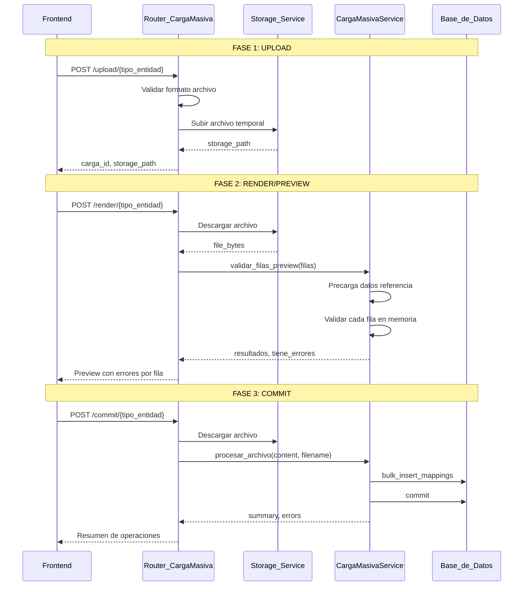

# Especificación Técnica - Sistema de Carga Masiva Genérica

Este documento contiene la especificación técnica completa del sistema de carga masiva genérica implementado en este proyecto.

## Índice

1. [Resumen del Sistema](#resumen-del-sistema)
2. [Diagrama de Arquitectura](#diagrama-de-arquitectura)
3. [Interfaz del Servicio](#interfaz-del-servicio)
4. [Implementación del Router](#implementación-del-router)
5. [Requerimientos Funcionales](#requerimientos-funcionales)
6. [Requerimientos No Funcionales](#requerimientos-no-funcionales)
7. [Estructura de Respuestas](#estructura-de-respuestas)
8. [Checklist de Validaciones](#checklist-de-validaciones)
9. [Antipatrones a Evitar](#antipatrones-a-evitar)

---

## 1. Resumen del Sistema

El sistema implementa un patrón de **carga masiva en 3 fases**:

```
UPLOAD → RENDER (Preview) → COMMIT (Persistir)
```

Este patrón permite al usuario:
1. **Subir** un archivo Excel/CSV
2. **Previsualizar** con errores de validación por fila (sin persistir)
3. **Confirmar** solo cuando esté satisfecho con los resultados

---

## 2. Diagrama de Arquitectura



---

## 3. Interfaz del Servicio (Contrato Obligatorio)

Cada servicio de carga masiva DEBE implementar la interfaz `ICargaMasivaService`:

### Métodos Obligatorios

#### 3.1 Constructor

```python
def __init__(self, db: Session):
    """
    Args:
        db: Sesión de SQLAlchemy para operaciones de BD
    """
    self.db = db
    self.errores: List[Dict[str, Any]] = []
    self.summary: Dict[str, int] = {
        "total_filas": 0,
        "creados": 0,
        "actualizados": 0,
        "omitidos_duplicados": 0,
        "con_errores": 0,
    }
```

#### 3.2 validar_filas_preview()

```python
def validar_filas_preview(self, filas: List[Dict]) -> Tuple[List[Dict], bool]:
    """
    Valida todas las filas en memoria SIN persistir.

    Args:
        filas: Lista de diccionarios (cada uno = una fila del archivo)

    Returns:
        Tuple[resultados, tiene_errores]:
        - resultados: Lista de dicts con keys:
            * success: bool
            * data: dict (fila limpia de NaN)
            * fila: int | str (número o '-')
            * error: str (errores concatenados con "; ")
        - tiene_errores: bool
    """
```

**Ejemplo de retorno:**

```python
([
    {'success': True, 'data': {...}, 'fila': '-', 'error': ''},
    {'success': False, 'data': {...}, 'fila': 3, 'error': 'CÓDIGO requerido; CATEGORÍA no existe'}
], True)
```

#### 3.3 procesar_archivo()

```python
def procesar_archivo(self, content: bytes, filename: str) -> Dict[str, Any]:
    """
    Procesa el archivo y persiste en BD.

    Args:
        content: Contenido del archivo en bytes
        filename: Nombre del archivo (.csv, .xlsx, .xls)

    Returns:
        Dict con keys:
        - summary: dict con total_filas, creados, actualizados, con_errores
        - errors: list de dicts con fila, error, data
        - message: str resumen legible
    """
```

**Ejemplo de retorno:**

```python
{
    'summary': {
        'total_filas': 100,
        'creados': 95,
        'actualizados': 0,
        'con_errores': 5
    },
    'errors': [
        {'fila': 3, 'error': 'CÓDIGO duplicado', 'data': {...}},
        {'fila': 7, 'error': 'CATEGORÍA no existe', 'data': {...}}
    ],
    'message': 'Se crearon 95 registros. Se encontraron 5 errores.'
}
```

### Métodos Recomendados

#### 3.4 _precache_data()

```python
def _precache_data(self):
    """
    Carga datos de referencia en memoria.

    Patrón típico:
        self.categorias_map = {c.nombre.upper(): c.id for c in categorias}
        self.codigos_existentes = set(p.codigo for p in productos)
    """
```

#### 3.5 _get_column_map()

```python
def _get_column_map(self) -> Dict[str, str]:
    """
    Retorna mapeo de columnas del archivo a nombres internos.

    Ejemplo:
        return {
            "CÓDIGO": "codigo",
            "NOMBRE PRODUCTO": "nombre",
            "CATEGORÍA": "categoria",
        }
    """
```

### Métodos Utilitarios

| Método | Descripción |
|--------|-------------|
| `normalizar_texto(texto)` | Lowercase, sin tildes, sin espacios extra |
| `safe_upper(value)` | Uppercase seguro, maneja NaN/None |
| `limpiar_nan(obj)` | Limpia NaN recursivamente |
| `leer_archivo(content, filename)` | Lee CSV/Excel a DataFrame |
| `aplanar_nombre_columna(nombre)` | Normaliza nombres de columnas |

---

## 4. Implementación del Router

El router es **genérico** y no necesita modificarse al agregar nuevas entidades.

### Configuración de Entidades

```python
# Enum de tipos soportados
class TipoEntidad(str, Enum):
    PRODUCTOS = "productos"
    PROVEEDORES = "proveedores"
    # Agregar nuevos aquí

# Mapeo a servicios
SERVICIOS_MAP = {
    "productos": CargaMasivaProductoService,
    "proveedores": CargaMasivaProveedorService,
    # Agregar nuevos aquí
}

# Mapeo a rutas de storage
STORAGE_PATH_MAP = {
    TipoEntidad.PRODUCTOS: "uploads/productos",
    TipoEntidad.PROVEEDORES: "uploads/proveedores",
    # Agregar nuevos aquí
}
```

### Endpoints

#### 4.1 POST /upload/{tipo_entidad}

**Parámetros:**
- `user_id` (query): ID del usuario
- `tipo_entidad` (path): Tipo de entidad
- `file` (form-data): Archivo

**Proceso:**
1. Validar formato (CSV, XLS, XLSX)
2. Validar permisos usuario
3. Generar UUID único
4. Subir a storage
5. Retornar carga_id

#### 4.2 POST /render/{tipo_entidad}

**Parámetros:**
- `user_id` (query): ID del usuario
- `tipo_entidad` (path): Tipo de entidad
- `carga_id` (form): UUID de la carga
- `filename` (form): Nombre del archivo

**Proceso:**
1. Descargar archivo del storage
2. Parsear a DataFrame
3. Normalizar columnas
4. Instanciar servicio
5. Llamar `validar_filas_preview()`
6. Retornar resultados

#### 4.3 POST /commit/{tipo_entidad}

**Parámetros:**
- `user_id` (query): ID del usuario
- `tipo_entidad` (path): Tipo de entidad
- `carga_id` (form): UUID de la carga
- `filename` (form): Nombre del archivo

**Proceso:**
1. Descargar archivo del storage
2. Instanciar servicio
3. Llamar `procesar_archivo()`
4. Commit a BD
5. Retornar resumen

---

## 5. Requerimientos Funcionales

| ID | Requisito | Descripción |
|----|-----------|-------------|
| RF-001 | Upload | Permitir CSV, XLS, XLSX. Validar formato y permisos. Retornar carga_id único. |
| RF-002 | Preview | Validar todas las filas sin persistir. Mostrar errores por fila con número y mensaje. |
| RF-003 | Commit | Insertar en batch. Rollback si falla. Retornar resumen de operaciones. |
| RF-004 | Mapeo | Normalizar columnas del archivo a nombres internos. Soportar aliases. |
| RF-005 | Errores | Todo error debe ser visible: número de fila, mensaje, datos. Sin errores silenciosos. |
| RF-006 | Extensibilidad | Agregar nuevas entidades sin modificar router. Registro declarativo en mapas. |

---

## 6. Requerimientos No Funcionales

| ID | Requisito | Descripción |
|----|-----------|-------------|
| RNF-001 | Performance | Procesar +6,000 registros en <30s. Usar bulk_insert. Precarga de datos de referencia. |
| RNF-002 | Escalabilidad | Agregar nuevas entidades sin modificar router. Registro declarativo en mapas. |
| RNF-003 | Mantenibilidad | Separación router/servicio. Servicios independientes por entidad. |
| RNF-004 | Seguridad | Validar roles. Storage temporal seguro. Limpieza tras commit/error. |
| RNF-005 | Trazabilidad | Logging de operaciones. Registro de usuario. Timestamps. |

---

## 7. Estructura de Respuestas

### Upload Response

```json
{
  "code": 200,
  "message": "Archivo subido exitosamente.",
  "data": {
    "carga_id": "550e8400-e29b-41d4-a716-446655440000",
    "storage_path": "uploads/productos/550e.../archivo.xlsx",
    "filename": "archivo.xlsx"
  }
}
```

### Render Response

```json
{
  "code": 200,
  "message": "Validación completada.",
  "data": [
    {"success": true, "data": {...}, "fila": "-", "error": ""},
    {"success": false, "data": {...}, "fila": 3, "error": "CÓDIGO duplicado; CATEGORÍA no existe."}
  ],
  "tiene_errores": true,
  "numero_filas": 100
}
```

### Commit Response

```json
{
  "code": 200,
  "message": "Archivo procesado y datos guardados exitosamente.",
  "data": [{
    "summary": {
      "total_filas": 100,
      "creados": 95,
      "actualizados": 0,
      "con_errores": 5
    },
    "errors": [
      {"fila": 3, "error": "...", "data": {...}}
    ],
    "message": "Se crearon 95 productos. Se encontraron 5 errores."
  }]
}
```

---

## 8. Checklist de Validaciones

### Validaciones Comunes

| Tipo | Descripción | Patrón |
|------|-------------|--------|
| Requerido | Campo no vacío, no null, no NaN | `if not campo:` |
| Fecha | Parsear múltiples formatos | DD/MM/YYYY, YYYY-MM-DD |
| Enum | Solo valores permitidos | `if valor not in valores_validos:` |
| FK | Entidad referenciada existe | `if not id in referencias_map:` |
| Único BD | No duplicado en base de datos | `if valor in existentes_set:` |
| Único archivo | No duplicado en mismo archivo | `if valor in vistos_set:` |
| Numérico | Convertible a número | `try: float(valor)` |
| Email | Formato válido | `re.match(r'^[\w\.-]+@[\w\.-]+\.\w+$', email)` |
| RUC/DNI | Longitud correcta | `len(ruc) == 11` |

### Patrón de Validación

```python
# Sets para cache
codigos_existentes: set = set()  # De BD
codigos_en_archivo: set = set()  # En el archivo

for idx, row in enumerate(filas, start=2):
    errores_fila: List[str] = []

    # Validación 1: Campo requerido
    codigo = safe_upper(row.get("codigo", ""))
    if not codigo:
        errores_fila.append("CÓDIGO es requerido.")
    else:
        # Validación 2: Único en BD
        if codigo in codigos_existentes:
            errores_fila.append(f"CÓDIGO '{codigo}' ya existe en BD.")
        # Validación 3: Único en archivo
        if codigo in codigos_en_archivo:
            errores_fila.append(f"CÓDIGO '{codigo}' duplicado en archivo.")
        codigos_en_archivo.add(codigo)

    # Resultado
    if errores_fila:
        resultados.append({
            'success': False,
            'fila': idx,
            'error': "; ".join(errores_fila),
            'data': limpiar_nan(row)
        })
    else:
        resultados.append({
            'success': True,
            'fila': '-',
            'error': '',
            'data': limpiar_nan(row)
        })
```

---

## 9. Antipatrones a Evitar

### ❌ Antipatrón 1: Duplicados Silenciosos

**Incorrecto:**
```python
if codigo in codigos_existentes:
    self.summary["con_errores"] += 1
    continue  # No se registra el error
```

**Correcto:**
```python
if codigo in codigos_existentes:
    self.errores.append({
        "fila": fila_numero,
        "error": f"CÓDIGO '{codigo}' duplicado.",
        "data": row.to_dict()
    })
    continue
```

### ❌ Antipatrón 2: Errores Dobles

**Incorrecto:**
```python
if not campo:
    errores.append("CAMPO requerido.")
if campo == "":
    errores.append("CAMPO vacío.")  # Doble error
```

**Correcto:**
```python
if not campo:
    errores.append("CAMPO es requerido.")
elif campo not in valores_validos:
    errores.append("CAMPO inválido.")
```

### ❌ Antipatrón 3: Vacíos en Sets

**Incorrecto:**
```python
codigo = row.get("codigo", "")
codigos_en_archivo.add(codigo)  # Agrega "" si está vacío
```

**Correcto:**
```python
codigo = safe_upper(row.get("codigo", ""))
if not codigo:
    errores.append("CÓDIGO requerido.")
else:
    codigos_en_archivo.add(codigo)
```

### ❌ Antipatrón 4: Campos No Mapeados

**Incorrecto:**
```python
# Solo mapea algunas columnas, las demás se pierden
column_map = {
    "CÓDIGO": "codigo",
    "NOMBRE": "nombre"
}
```

**Correcto:**
```python
# Mapea TODAS las columnas del archivo
column_map = {
    "CÓDIGO": "codigo",
    "CODIGO": "codigo",  # Alias
    "NOMBRE": "nombre",
    "NOMBRE PRODUCTO": "nombre",  # Alias
    "DESCRIPCIÓN": "descripcion",
    "DESCRIPCION": "descripcion",
    "CATEGORÍA": "categoria",
    "CATEGORIA": "categoria",
    "PRECIO": "precio",
    "STOCK": "stock"
}
```

### ❌ Antipatrón 5: String Vacío vs None

**Incorrecto:**
```python
# Guarda "" en BD cuando debería ser NULL
descripcion = str(row.get("descripcion", ""))
```

**Correcto:**
```python
# Guarda NULL si está vacío
descripcion = str(row.get("descripcion", "")).strip() or None
```

---

## Apéndice: Guía Paso a Paso para Nueva Entidad

### Paso 1: Crear el Modelo

```python
# app/models/models.py
class NuevaEntidad(Base, TimestampMixin):
    __tablename__ = "nueva_entidad"

    id = Column(Integer, primary_key=True, index=True)
    codigo = Column(String(50), unique=True, nullable=False)
    nombre = Column(String(200), nullable=False)
    # ... más campos
```

### Paso 2: Crear el Servicio

```python
# app/services/carga_masiva_nueva_entidad_service.py
class CargaMasivaNuevaEntidadService(ICargaMasivaService):
    def __init__(self, db: Session):
        super().__init__(db)
        self.codigos_existentes = set()

    def _precache_data(self):
        entidades = self.db.query(NuevaEntidad.codigo).all()
        self.codigos_existentes = {e.codigo for e in entidades}

    def validar_filas_preview(self, filas: List[Dict]) -> Tuple[List[Dict], bool]:
        # Implementar validaciones
        pass

    def procesar_archivo(self, content: bytes, filename: str) -> Dict[str, Any]:
        # Implementar persistencia
        pass
```

### Paso 3: Registrar en el Sistema

```python
# app/schemas/schemas.py
class TipoEntidad(str, Enum):
    PRODUCTOS = "productos"
    NUEVA_ENTIDAD = "nueva_entidad"  # Agregar

# app/routers/carga_masiva.py
SERVICIOS_MAP = {
    "productos": CargaMasivaProductoService,
    "nueva_entidad": CargaMasivaNuevaEntidadService,  # Agregar
}

STORAGE_PATH_MAP = {
    TipoEntidad.PRODUCTOS: "uploads/productos",
    TipoEntidad.NUEVA_ENTIDAD: "uploads/nueva_entidad",  # Agregar
}
```

### Paso 4: ¡Listo!

Los endpoints quedan automáticamente disponibles:
- `POST /api/v1/carga-masiva/upload/nueva_entidad`
- `POST /api/v1/carga-masiva/render/nueva_entidad`
- `POST /api/v1/carga-masiva/commit/nueva_entidad`

---

**Fin de la Especificación Técnica**
